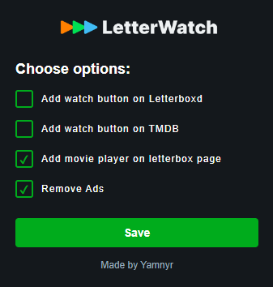

# Letterwatch

Made by **Yamnyr**

## Description

**Letterwatch** is a Chrome extension that provides easy access to a player for watching films from Letterboxd and TMDB. Here’s what the extension does:

- **Integrated Player**: Adds an integrated player on Letterboxd (`letterboxd.com`), allowing you to view films directly on the platform.
- **Discreet Play Button**: Adds a button on Letterboxd pages that directs you to a page containing the player.
- **Play Button on TMDB**: Adds a similar button on TMDB pages that directs you to a page with the player.
- **Ad Blocking**: Disables ads on Letterboxd. Some players may not work with an ad blocker, so this feature allows you to disable ads without using an ad blocker.
- **Multiple Player Options**: Whether on the separate player page or the integrated player on Letterboxd, multiple players are available in case some do not suit your needs.

## Installation

1. **Download**:
    - Download the extension from [the Letterwatch GitHub repository](https://github.com/Yamnyr/Letterwatch).

2. **Installation**:
    - Open Chrome and go to `chrome://extensions/`.
    - Enable **Developer mode**.
    - Drag the extracted folder into the extensions page.

## Usage

Once the extension is installed:

- You can access the popup to configure the extension.

---

Thank you for using Letterwatch!
